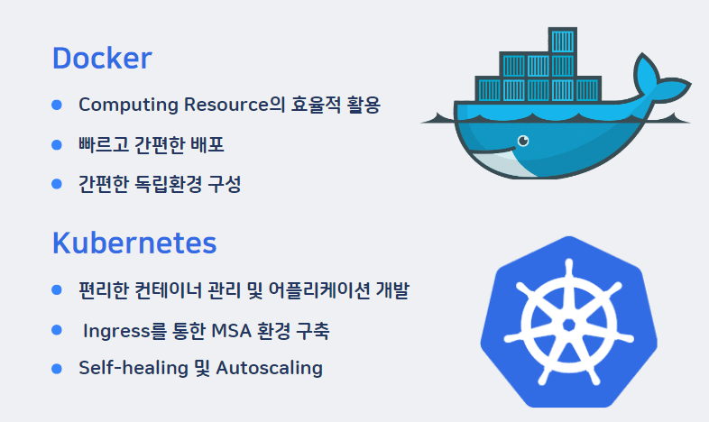

# Cloud

P-ZONE 클라우드 수행 보고서

P-ZONE 프로젝트의 클라우드 파트에서는 전체적인 서버의 흐름을 설계하고 구성하였다.

### 1.구성

컨테이너 중심 배포로 진행하였다.

컴퓨팅 자원을 효율적으로 활용하기 위해

빠르게 배포 및 업데이트 하기 위해

간편하게 MSA 환경을 구축하기 위해

여러 상황에 대한 유연한 대처를 하기 위한 목적으로 선택하였다.

### 2. 설계

설계 단계에서 보안성과 탄력성 및 안정성을 고려하여 설계하였다. 

AWS Resource를 사용하여 Architecture를 구성하였다. 

그림1. 클라우드 아키텍쳐 전체 구성도

### 2-1. 보안성 고려 

1.ACM에서 인증서 발급을 통한 HTTPS 통신

2.Node Instance를 Private-Subnet에 배치와 Public에 LB와 NAT-Gateway 구성 : Server로의 Inbound차단
 
### 2-2 탄력 및 안정성 고려 

1. 가용 영역 분리를 통한 안정성 

2. Horizontal Pod Autoscaling과 Cluster Autoscaling을 통한 다양한 트래픽 상황에 대처

3. LoadBalncer를 통한 트래픽 분산

### 2-3 Iot센서와 데이터 연계 과정

1. 기울기센서-NodeMCU에서 IoT-CORE에 PUB

2. SUB한 IoT-CORE에서 데이터 들어올시 규칙을 통해 Lambda 실행

3. Lambda에서 데이터 가공 및 RDS에 INSERT

4. Node의 Back-End Pod에서 SELECT 

### 2-4 Image-Path

1. Git Push 

2. Docker Image Build

3. ECR Public Repository로 Push

4. Kubernetes Image Path로 지정

