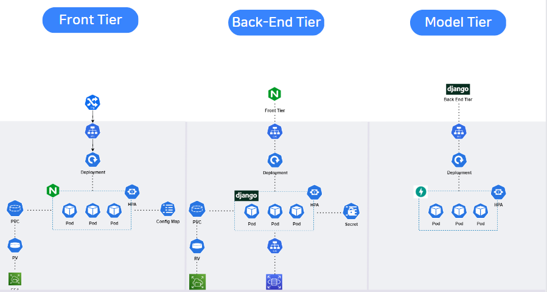
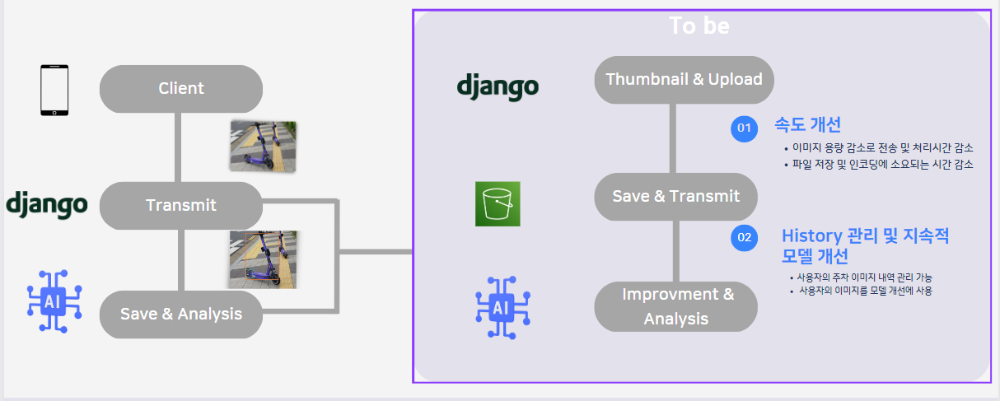

# Cloud

P-ZONE 클라우드 수행 보고서

담당： 조정희

P-ZONE 프로젝트의 클라우드 파트에서는 전체적인 서버의 흐름을 설계하고 구성하였다.

### 1. 구성

도커와 쿠버네티스를 이욯한 컨테이너 중심 배포로 진행하였다.

목적은 다음과 같다

－ 컴퓨팅 자원을 효율적으로 활용하기 위해

－ 빠르게 배포 및 업데이트 하기 위해

－ 간편하게 MSA 환경을 구축하기 위해

－ 여러 트래픽 상황에 대한 유연한 대처를 하기 위해

### 2. 설계

 
＜클라우드 아키텍쳐 전체 구성도＞

AWS Resource를 사용하여 Architecture를 구성하였다.

### 2-1. 보안성 고려 

1. ACM에서 인증서 발급을 통한 HTTPS 통신

2. Node Instance를 Private-Subnet에 배치와 Public에 LB와 NAT-Gateway 구성 : Server로의 Inbound차단
 
### 2-2 탄력 및 안정성 고려 

1. 가용 영역 분리를 통한 안정성 

2. Horizontal Pod Autoscaling과 Cluster Autoscaling을 통한 다양한 트래픽 상황에 대처

3. LoadBalncer를 통한 트래픽 분산

### 2-3 Iot센서와 데이터 연계 과정

1. 기울기센서-NodeMCU에서 IoT-CORE에 PUB

2. SUB한 IoT-CORE에서 데이터 들어올시 규칙을 통해 Lambda 실행

3. Lambda에서 데이터 가공 및 RDS에 INSERT

4. Node의 Back-End Pod에서 SELECT 

### 2-4 Image-Path

1. Git Push 

2. Docker Image Build

3. ECR Public Repository로 Push

4. Kubernetes Image Path로 지정

### 2-5 Tier구성
<Tier 구성도>

총 Front , Back-End ,Model Tier로 구성하였다. 
빅데이터 팀원들이 구성한 모델을 Fast Api로 API를 구성한 뒤  
모델 SVC로 넘겨 분석하는 구조로 구성하였다.

/ 진행 /

1. Client가 IMAGE Request 
2. Ingress가 지정한 Path에 따라 Front Tier SVC 연결  
3. Back-End SVC로 Pass  
4. Model Tier로 request  
5. Model에서 분석 후  결과 Client Response

/Kubernetes Resource/

- Ingress: Url Path에  지정된 Service에 따라 Request 분리
- Service: Pod에 대한 접근 Endpoint 생성 , RDS에 대한 External name으로 접근
- Configmap: nginx.conf CM으로 등록 후 Front에서 Volume mount
- Secret: Django-secret 및 RDS Acess 정보 Secret 등록 후 환경변수로 활용
- PV,PVC: Amazon EFS (NFS)를 PV로 지정하고, Claim을 통해 정적파일 mount
- HPA: Traffic의 변동에 따라 유연하게 Pod 개수 조절 

### 3. 보완점

현 문제 : 

- 용량이 큰 Image 다중 HTTP request
- base 64 encoding 작업
- 고객 History 관리x + 지속적 관리 모델 필

To be:   
1. S3 Object storage를 배치
2. thumbnail화를 통해 Image 용량 감소 후 저장
3. Django에서 image request가 아닌 Object endopoint 전송

기대 효과:

- 속도 개선
- Object storage 저장을 통한 Histroy 관리 
- 순환 Architecture: Client가 보낸 사진을 모델 학습에 사용 -> 개선 모델 서비스 사용

### 4. 향후 개선방향

1. AWS WAF를 통한 Traffic 검열: 보안성 증가
2. Kubernetes Secret(단순 Base64 Encoding)이 아닌 Secret Manager 사용: 보안성 증가
3. Git action을 통한 CI/CD : 통합 배포 파이프라인 구축, 간편화
4. Session Affinity => Redis같은 In Memory DB 사용: 로그인 세션 관리
5. log EFS 저장 => Cronjob => S3 log 저장 : 백업 + 자동화
